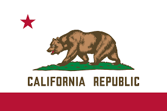
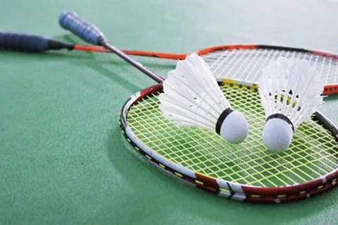

# 🌟 Aditya Samavedam's Blog 🌟

  

    
    
California Resident for 8 years

  

  

    
    
Citizen of USA

  

  

    
    
Lived in India from 1st through 8th grade

  

<button id="toggleDarkMode">Toggle Dark Mode</button>

# Journey of my life:

- #### 🏥 Born in 2008 in Scripps Memorial Hospital, La Jolla
- #### 🏡 Lived in Scripps Ranch for six years
- #### ✈️ Moved to Hyderabad, India in 2014 because my grandparents were ill
- #### 🏫 Did my 1st through 8th grade in India
- #### ↩️ Moved back to San Diego in 2022 because my sister got into UCI
- #### 🏫 Started high school here as a Freshman at Del Norte

### Check out my <a href="https://github.com/AdityaSamavedam" target="_blank">Github page</a>
 
 
### 🙂A few things About Me🙂
 

  
1 / 6

  
  
Junior at DNHS

  
2 / 6

  
  
Second Degree Black Belt in Taekwondo

  
3 / 6

  
  
Wants to major in CS and likes Python

  
4 / 6

  
  
Likes to play badminton

  
5 / 6

  
  
Loves to play Brawl Stars but I'm noob

  
6 / 6

  
  
Also loves to play Mario Kart Wii

<a class="prev" onclick="plusSlides(-1)">⏪</a>
<a class="next" onclick="plusSlides(1)">⏩</a>

 

   
   
  
  
  
  

 
 
<h3>Best song in the world: <a href="https://www.youtube.com/watch?v=xvFZjo5PgG0" target="_blank" style="color:turquoise">Click this link !!!</a></h3>
 
 
# My Culture and Family
 

- I am a Indian and I am also Hindu.
- My family is pretty small but I also have a sister who is about 21 years old.
- Most of my relatives live in India and when I lived in Hyderabad, I used to visit them every year

<button id="quoteButton">Show Me a Motivational Quote</button>

