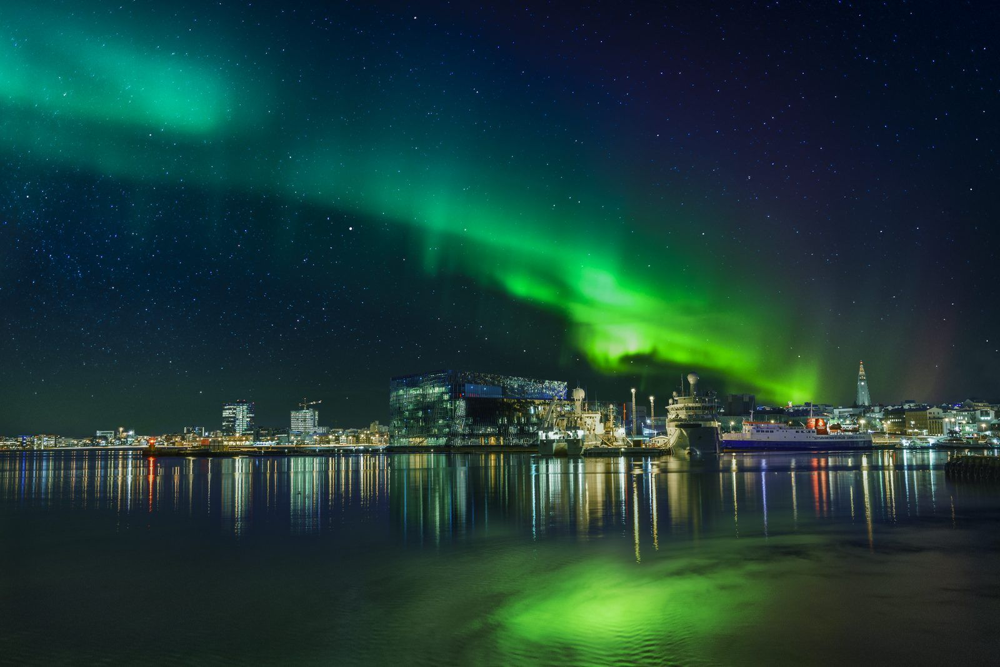
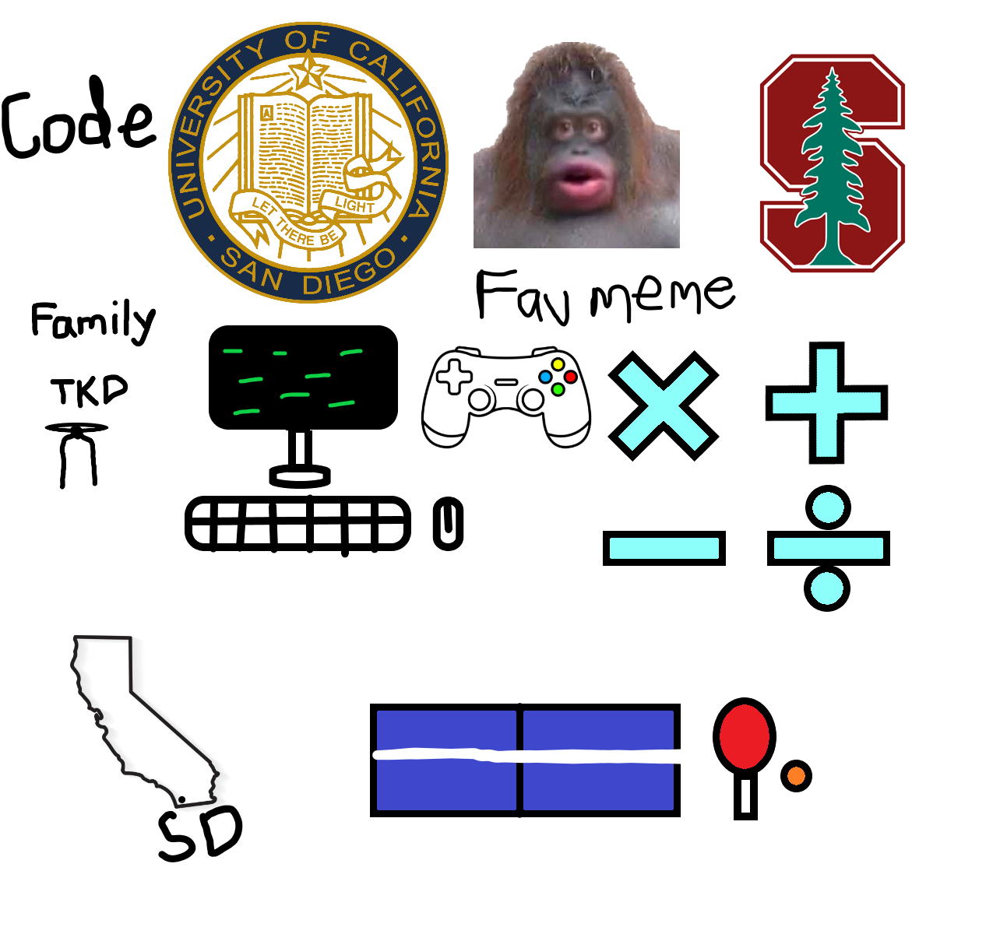

<html lang="en">
<head>
    <meta charset="UTF-8">
    <meta name="viewport" content="width=device-width, initial-scale=1.0">
    <title>Aditya Samavedam's Blog</title>
    
</head>
<body>
    <header>
        <h1>🌟 Aditya Samavedam's Blog 🌟</h1>
        <button id="toggleDarkMode">Toggle Dark Mode</button>
    </header>
    

        <h2>Check out my <a href="https://github.com/AdityaSamavedam" target="_blank">Github page</a>!</h2>

        <h3>🌌 The Reykjavik Northern Lights are Beautiful 🌌</h3>
        

        <h3>🎨 My Freeform Picture 🎨</h3>
        

        <h3>🎓 About Me 🎓</h3>
        

            <ul>
                <li>Junior at <a href="https://en.wikipedia.org/wiki/Del_Norte_High_School_(San_Diego)" target="_blank" style="color:deepskyblue">Del Norte High School</a>.</li>
                <li>Second Degree Black Belt in Taekwondo</li>
                <li>Codes mostly in Python, has worked with AI/ML.</li>
                <li>Has lived in <a href="https://www.youtube.com/watch?v=CNDI4WlJ8eo" target="_blank" style="color:darkorange">India</a> for 8 years.</li>
                <li>Aspires to major in Computer Science.</li>
                <li>Loves to <a href="https://www.youtube.com/@Pongfinity" target="_blank" style="color:red">watch Table Tennis</a>, and also plays it.</li>
                <li>Destroys people at badminton.</li>
                <li>Loves to play Mario Kart Wii and Brawl Stars.</li>
            </ul>
        

        
        <h3>Best song in the world: <a href="https://www.youtube.com/watch?v=xvFZjo5PgG0" target="_blank" style="color:turquoise">Click this link !!!</a></h3>
        <button id="quoteButton">Show Me a Motivational Quote</button>
        

    

    
</body>
</html>
